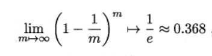

# 模型评估与选择
## 经验误差与过拟合
- 错误率(error rate): **m**个样本中有**a**个样本分类错误,则错误率E = a/m
- 精度(accuracy): 精度 = 1 - 错误率
- 误差(error): 学习器的实际预测输出与样本的真实输出之间的差异
- 训练误差(training error): 又称经验误差(empirical error),学习器在训练集上的误差
- 泛化误差(generalization error): 学习器在新样本上的误差
- 过拟合(overfitting): 学习器将训练样本自身的一些特点当作所有潜在样本都会具有的一般性质,这样会导致泛化性能下降,这种现象叫过拟合.过拟合形成的原因是因为学习能力过于强大
- 欠拟合(underfitting):与过拟合相对,指对训练样本的一般性质尚未学好,.欠拟合形成的原因是因为学习能力低下造成的
## 评估方法
### 留出法(hold-out)
直接将数据集D划分为两个互斥的集合,一个集合作为训练集S,一个集合作为测试集T,即D = S ∪ T且S ∩ T = Ø.
需要注意的问题:
1. 训练/测试集的划分要尽可能的保持数据一致性.如果从采样(sampling)的角度来看待数据集的划分过程,则保留类别比例的采样方式.这种方法叫做**分层采样(stratified sampling)**
2. 使用留出法的时候一般要采用若干次随机划分,重复进行实验评估后取平均值作为留出法的评估结果.

留出法常见做法是将2/3~4/5的样本作为训练,剩余样本作为测试
### 交叉验证法(cross validation)
将数据集D划分为k个大小相似的互斥子集,即D = D1 ∪ D2 ∪ ... ∪ Dk, Di ∩ Dj = Ø.每个子集尽可能的保持数据分布一致性,即从D中通过分层采样得到.然后每次使用k-1个子集作为训练集,剩下的那个子集作为测试集;这样就可以就进行k次训练和测试,最终返回的是k个测试结果的均值. 这种方法又称为**k折交叉验证(k-fold cross validation)**
### 自主法(bootstrapping)
给定包含m个样本的数据集D, 我们对D进行随机采样产生数据集S:每次随机从D中挑选一个样本,将其copy进S,然后将该样本放回数据集D,使得该样本下次仍然有机会被采到;这个过程重复m次,我们就可以得到一个样本数量为m的测试集S.

一个样本在m次采样中始终不被采到的概率:

于是我们将数据集S作为训练集, D\S 用作测试集(\代表集合的减法)

这用实际评估的模型与期望评估的模型都使用m个训练样本,而我们仍有数据总量的1/3没有在训练集中出现的样本用作测试.这用的测试结果称为**包外估计**(out-of-bagestimate)

自助法一般用于数据量较小,难以有效划分训练集和测试集的时候用.当初始数据量较大的时候,留出法与交叉验证法更加常用一些.

## 性能度量
性能度量(performance measure): 衡量模型泛化能力的评价标准.
性能度量反映了任务需求,在对比不同模型的能力时, 使用不同的性能度量往往会导致不同的评判结果;这以为着模型的"好坏"是相对的,模型的好坏不仅取决于算法,还取决于任务需求