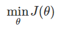
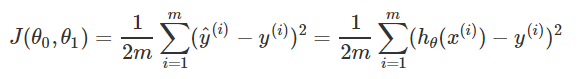

# 代价方程cost function
能找出方程最优解的方程
假设有训练样本(x, y)，模型为h，参数为θ。h(θ) = θTx（θT表示θ的转置）。

（1）概况来讲，任何能够衡量模型预测出来的值h(θ)与真实值y之间的差异的函数都可以叫做代价函数C(θ)，如果有多个样本，则可以将所有代价函数的取值求均值，记做J(θ)。因此很容易就可以得出以下关于代价函数的性质：

对于每种算法来说，代价函数不是唯一的；
代价函数是参数θ的函数；
总的代价函数J(θ)可以用来评价模型的好坏，代价函数越小说明模型和参数越符合训练样本(x, y)；
J(θ)是一个标量；
（2）当我们确定了模型h，后面做的所有事情就是训练模型的参数θ。那么什么时候模型的训练才能结束呢？这时候也涉及到代价函数，由于代价函数是用来衡量模型好坏的，我们的目标当然是得到最好的模型（也就是最符合训练样本(x, y)的模型）。因此训练参数的过程就是不断改变θ，从而得到更小的J(θ)的过程。理想情况下，当我们取到代价函数J的最小值时，就得到了最优的参数θ，记为：

例如，J(θ) = 0，表示我们的模型完美的拟合了观察的数据，没有任何误差。

（3）在优化参数θ的过程中，最常用的方法是梯度下降，这里的梯度就是代价函数J(θ)对θ1, θ2, ..., θn的偏导数。由于需要求偏导，我们可以得到另一个关于代价函数的性质：

选择代价函数时，最好挑选对参数θ可微的函数（全微分存在，偏导数一定存在）

## 常见形式
### 均方误差
在线性回归中，最常用的是均方误差(Mean squared error)

- m：训练样本的个数；
- hθ(x)：用参数θ和x预测出来的y值；
- y：原训练样本中的y值，也就是标准答案
- 上角标(i)：第i个样本
- 1/2是为了只是为了减少个别较大的极端值对代价函数的影响，这里面的极端值就好比噪声，前面加个小于1的系数，可以看做是为了减少噪声的影响。一般都是选择1/2这个数值。